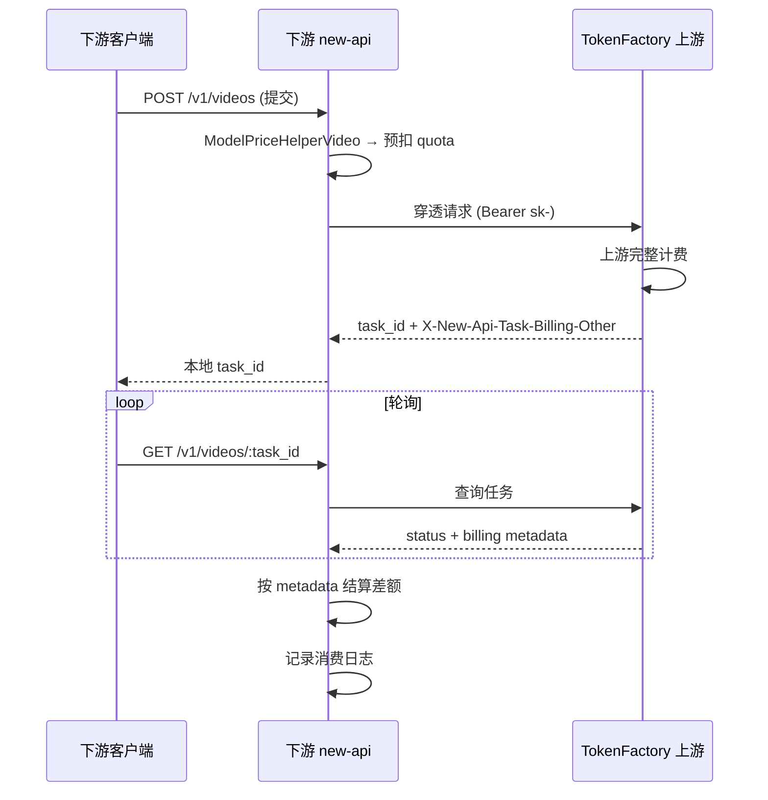

# TokenFactoryOpen 对接指南

> 面向 **new-api 平台二次开发者**：通过渠道类型 **TokenFactoryOpen（type=60）** 对接 TokenFactory 上游，复用生图、生视频及复杂计费能力。

**文档版本**：1.0  
**适用上游**：TokenFactory（基于 new-api 二开）  
**对接方式**：单渠道类型 + API Key + 渠道同步

---

## 1. 架构概览

### 1.1 角色与计费边界

```
终端用户 ──扣费──► 下游 new-api（零售价）
                      │
                      │  Bearer sk-xxx
                      ▼
                 TokenFactory 上游（批发价/成本价）
                      │
                      ▼
                 真实厂商 API
```

| 层级 | 扣费对象 | 定价来源 | 说明 |
|------|----------|----------|------|
| 上游 → 下游 | 下游持有的 `sk-` 令牌对应账户 | TokenFactory 平台规则 | 合作伙伴从你们采购额度 |
| 下游 → 用户 | 下游终端用户 | **下游自行配置** | 可基于同步的零售价加价 |

**重要原则**：上游通过响应头传递 **计费元数据**（tokens、秒数、分辨率等），**不传递可直接用于下游扣费的价格字段**（如 `video_billed_quota`、`video_token_unit_price` 在 TokenFactoryOpen 穿透时会被过滤）。

### 1.2 为什么使用 type=60

- 只需实现 **一种渠道类型**，无需逐个适配 50–67 等厂商渠道
- 自动同步上游可售渠道列表（模型、路由、参考定价）
- 统一处理异步任务（提交 → 轮询 → 结算）
- 统一解析 `X-New-Api-Task-Billing-Other` 计费元数据

---

## 2. 下游改造清单

原版 [QuantumNous/new-api](https://github.com/QuantumNous/new-api) **无法直接对接**，至少需要合入或自行实现以下能力：

### 2.1 必改项

| 模块 | 内容 |
|------|------|
| `constant/channel.go` | 新增 `ChannelTypeTokenFactoryOpen = 60` |
| `controller/channel.go` | 创建 type=60 时拉取 `/api/tf_open_sync/channels` 并批量建子渠道 |
| `model/channel.go` | `TFOpenUpstreamPricing`、`BatchInsertChannelsWithTfOpenUpstreamPricing` |
| `relay/helper/model_mapped.go` | TokenFactoryOpen 路由改写（`model/route_slug`） |
| `middleware/distributor.go` | 读取 `other_info.upstream_route_slug` 写入路由上下文 |
| `relay/channel/task/openaivideo/adaptor.go` | 穿透适配：文本 / 生图 / 生视频多协议 |
| `relay/relay_task.go` | 异步任务预扣、轮询、结算 |
| `service/billing_session.go` | 预扣 → 差额结算 |
| `service/task_billing.go` | 解析 `X-New-Api-Task-Billing-Other` |
| `service/seedance_token_billing.go` | 视频 per_token 预扣与完成结算 |
| `setting/ratio_setting/image_pricing_rule.go` | 生图按张按分辨率计费 |
| `setting/ratio_setting/video_pricing_rule.go` | 生视频规则表计费 |
| `router/video-router.go` | `/v1/video/generations`、`/v1/videos` 等 |

### 2.2 推荐合入

- `relay/helper/image_price.go`、`image_billing.go`：生图预扣与响应后二次结算
- `relay/helper/price.go` 中 `ModelPriceHelperVideo`：视频三种计费模式
- `controller/tf_open_sync.go`：若下游也需要作为上游被同步

**最快路径**：直接 fork TokenFactory 仓库，或 cherry-pick 上述文件。

---

## 3. 渠道配置

### 3.1 上游（TokenFactory）准备

为每个合作伙伴：

1. 创建用户账户并发放 **API 令牌** `sk-xxxxxxxx`
2. （可选）配置 `TOKENFACTORY_OPEN_SYNC_SECRET` 环境变量，用于同步接口鉴权
3. 确保可售渠道已配置 `route_slug`（推荐）或 `channel_no`（如 `c1`）
4. 为模型打 tag：`视频`、`图片`（控制 endpoint 可见性）

### 3.2 下游创建渠道

1. 管理后台 → 新增渠道
2. **类型**：`TokenFactoryOpen (60)`
3. **Base URL**：上游平台根地址，如 `https://api.example.com`（不要带 `/v1`）
4. **密钥**：上游发放的 `sk-xxx`（完整 key，含 `sk-` 前缀）
5. 保存后系统自动调用 `GET /api/tf_open_sync/channels`，为每条上游渠道创建一条本地子渠道（同为 type=60）

### 3.3 同步后的子渠道元数据

每条子渠道 `other_info` 示例：

```json
{
  "source": "tokenfactory_open",
  "upstream_channel_id": 123,
  "upstream_channel_no": "c5",
  "upstream_route_slug": "seedance-pro",
  "upstream_supplier_alias": "P0",
  "upstream_channel_type": 65,
  "synced_at": 1710000000
}
```

### 3.4 路由规则

下游请求命中本地子渠道后，发往上游前会将模型名改写为：

| 方式 | 上游收到的 model | 优先级 |
|------|------------------|--------|
| 新版 | `{model}/{route_slug}` | 高（`upstream_route_slug` 有效时） |
| 旧版 | `{alias}/{model}/{channel_no}` | 回退 |
| 强制 | `?channel=c5` 或模型后缀 `/c5` | Playground 调试 |

**注意**：

- type=60 渠道 **不要配置 model_mapping**（代码会跳过，避免 `/` 被误解析）
- 下游对外暴露的模型名应与上游一致（如 `Seedance2.0`）

---

## 4. 同步 API

### 4.1 导出渠道列表

```
GET {upstream}/api/tf_open_sync/channels
```

**鉴权**（满足其一即可）：

- 请求头 `X-TokenFactory-Open-Sync-Secret: {secret}`
- 请求头 `Authorization: Bearer sk-xxx`（普通 API 令牌）
- 请求头 `Authorization: Bearer {access_token}`

**响应示例**：

```json
{
  "success": true,
  "data": {
    "channels": [
      {
        "id": 123,
        "name": "Seedance 官方",
        "models": "Seedance2.0",
        "group": "default",
        "status": 1,
        "type": 65,
        "channel_no": "c5",
        "route_slug": "seedance-pro",
        "supplier_alias": "P0",
        "supplier_type": "official",
        "price_discount_percent": 100,
        "operating_cost_percent": 0,
        "markup_discount_rate": 0,
        "model_mapping": "",
        "model_price": {
          "Seedance2.0": 0
        },
        "model_ratio": {}
      }
    ]
  }
}
```

**说明**：

- 响应 **不含渠道密钥**
- `type` 为上游真实渠道类型（仅供参考，下游本地一律存为 60）
- `model_price` / `model_ratio` 为渠道级 **参考成本价**（legacy 字段）
- **图片/视频规则表**见下文 §5.4（由 TokenFactory 额外提供零售价接口或扩展 export）

### 4.2 渠道测试（可选）

```
POST {upstream}/api/tf_open_sync/channel_test
Content-Type: application/json
Authorization: Bearer sk-xxx

{
  "model": "Seedance2.0",
  "endpoint_type": "video-generation",
  "upstream_route_slug": "seedance-pro"
}
```

---

## 5. 定价设计

### 5.1 总体原则

| 模型类型 | 下游必须配置 | 上游同步可提供 |
|----------|-------------|----------------|
| 文本 LLM | `model_ratio` / `model_price` + 用户组倍率 | `model_ratio`、`model_price` |
| 生图 | `ImagePricingRules` 按张按分辨率 | `image_pricing_rules`（建议零售价） |
| 生视频 | `VideoPricingRules` 规则表 | `video_pricing_rules`（建议零售价） |

**额度换算**（默认）：

```
quota = USD × QuotaPerUnit × group_ratio
```

默认 `QuotaPerUnit = 500000`（即 $0.002 / 1K tokens 量级，以实际上游 `GET /api/status` 返回为准）。

**双轨有效单价公式**（与 TokenFactory 一致，适用于规则表单价）：

```
有效单价 = 渠道规则价 × 成本折扣% + 全局规则价 × 加价折扣%
```

其中：

- `成本折扣%` = 渠道 `price_discount_percent`（默认 100）
- `加价折扣%` = 渠道 `markup_discount_rate`（默认 0，表示不加价）

下游若不做双轨，可简化为：

```
零售单价 = 同步建议零售价 × 自定义加价系数 × 用户组倍率
```

### 5.2 文本模型（同步即用）

**按 token 倍率**：

```
quota = (input_tokens × 有效输入倍率 + output_tokens × 有效输出倍率 + ...) × group_ratio
```

**按次固定价**：

```
quota = model_price × QuotaPerUnit × group_ratio
```

同步导入时，`model_price` / `model_ratio` 会写入本地渠道的 channel 级定价表，可作为 **成本底价**；下游在此基础上配置用户组倍率或全局加价。

### 5.3 生图定价（ImagePricingRules）

#### 5.3.1 数据结构

存储位置（Option）：

- 全局：`ImagePricingRules`（JSON map，key 为模型名）
- 渠道级：`ChannelImagePricingRules`（JSON map，key 为渠道 ID → 模型名）

```json
{
  "Qwen-Image": {
    "similarity_threshold": 0.35,
    "text_to_image_per_image": [
      { "resolution": "1024x1024", "image_price": 0.04 },
      { "resolution": "1280x720", "image_price": 0.05 }
    ],
    "image_to_image_per_image": [
      { "resolution": "1024x1024", "image_price": 0.06 }
    ]
  }
}
```

| 字段 | 说明 |
|------|------|
| `text_to_image_per_image` | 文生图，按张计费 |
| `image_to_image_per_image` | 图生图 / 带 image 输入，按张计费 |
| `resolution` | 档位标识，支持 `1024x1024`、`1280x720`、`720p` 等 |
| `image_price` | **美元/张**（与 `ModelPrice` 同单位） |
| `similarity_threshold` | 分辨率匹配阈值，默认 0.35 |

#### 5.3.2 能力识别

| 请求类型 | 计费模式 |
|----------|----------|
| `POST /v1/images/generations` 且无 image 输入 | `text_to_image` |
| `POST /v1/images/generations` 带 image 输入 | `image_to_image` |
| `POST /v1/images/edits` | `image_to_image` |

#### 5.3.3 分辨率匹配算法

1. 从请求 `size`（如 `1024x1024`）或响应图片解析宽高
2. 在当前能力（文生/图生）的规则表中，找 **像素数最接近** 的档位
3. 若像素差比例 > `similarity_threshold`，返回定价错误（列出支持档位）
4. 若请求分辨率 **超过** 最大档位，**封顶到最大档位**（`capped_to_max_tier`）

#### 5.3.4 扣费流程

```
1. 请求前：预扣 = 有效单价 × 请求张数(n) × QuotaPerUnit × group_ratio
2. 调用上游
3. 响应后：按实际出图张数、实际分辨率重新计算
4. BillingSession.Settle(差额)  // 多退少补
```

**预扣公式**：

```
pre_quota = ceil(eff_usd_per_image × count × QuotaPerUnit × group_ratio)
```

#### 5.3.5 未配置规则表时

若模型仅有 flat `ImagePrice`（无规则表），回退为按次固定价；**若规则表已配置但未匹配，不会静默回退**，会返回友好错误。

### 5.4 生视频定价（VideoPricingRules）

#### 5.4.1 数据结构

```json
{
  "Seedance2.0": {
    "similarity_threshold": 0.35,
    "text_to_video_per_token": [
      { "resolution": "720p", "has_audio": false, "price": 47.33 }
    ],
    "text_to_video_per_second": [
      { "resolution": "720p", "has_audio": false, "price": 0.05 },
      { "resolution": "720p", "has_audio": true, "price": 0.08 }
    ],
    "text_to_video_per_video": [
      { "resolution": "720p", "video_price": 0.30 }
    ],
    "image_to_video_per_token": [],
    "image_to_video_per_second": [],
    "image_to_video_per_video": [],
    "video_to_video_per_token": [],
    "video_to_video_per_second": [],
    "video_to_video_per_item": []
  }
}
```

**能力维度**（与请求体推断）：

| 模式 | JSON 前缀 | 触发条件 |
|------|-----------|----------|
| 文生视频 | `text_to_video_*` | 无 image/video 输入 |
| 图生视频 | `image_to_video_*` | 有 image 输入 |
| 视频生视频 | `video_to_video_*` | 有 video 输入 |

**计费模式优先级**（`ModelPriceHelperVideo`）：

```
1. per_token（*_per_token）   ← 最高
2. per_second（*_per_second）
3. per_video（*_per_video / *_per_item）
4. 无匹配 → 报错（不回退旧倍率）
```

#### 5.4.2 模式 A：按 Token（per_token）

适用：Seedance 2.0 等返回 `total_tokens` 的模型。

**规则字段**：

- `price`：**美元 / 1M tokens**（不是每个 token）

**预扣**：

- 固定预扣 `50000` tokens（`SeedanceTokenPreConsumeTokens`）
- 按请求分辨率匹配 `*_per_token` 行

**预扣公式**：

```
pre_quota = (50000 / 1_000_000) × eff_price_per_million × QuotaPerUnit × group_ratio
```

**完成结算**：

- 从上游任务结果或 `X-New-Api-Task-Billing-Other.video_total_tokens` 取实际 tokens
- `final_quota = (actual_tokens / 1_000_000) × eff_price_per_million × QuotaPerUnit × group_ratio`
- `Settle(final_quota - pre_quota)`

**billing_mode**：`video_token_output`

#### 5.4.3 模式 B：按秒（per_second）

**规则字段**：

- `price`：**美元 / 秒**
- `has_audio`：是否含音频轨道（分档计价）

**预扣公式**：

```
seconds = ceil(请求时长)   // 默认 5 秒
pre_quota = seconds × eff_price_per_second × QuotaPerUnit × group_ratio
```

**完成结算**：

- 优先使用上游返回的 `video_seconds` / `video_duration`
- 或 ffprobe 解析实际成片时长
- 按实际秒数重算并补差

**billing_mode**：`video_per_second`

#### 5.4.4 模式 C：按条（per_video）

**规则字段**：

- `video_price`：**美元 / 条**（flat per clip）
- 或 `*_per_item` 中带 `has_audio` 的分档

**预扣公式**：

```
pre_quota = eff_usd_per_video × QuotaPerUnit × group_ratio
```

视频生视频（V2V）可能合并 input + output 两档价格。

**billing_mode**：`video_per_video`

#### 5.4.5 分辨率匹配

与图片类似：根据请求 `size` / `metadata.resolution` / 宽高像素，在对应能力 + 计费模式的规则表中找最近档位；超过最大档时封顶。

### 5.5 TokenFactory 建议提供的零售价扩展

当前 `tf_open_sync` 已导出 `model_price` / `model_ratio`。建议上游额外在同步接口或独立定价接口中提供：

```json
{
  "id": 123,
  "model_price": { "...": 0 },
  "model_ratio": { "...": 2.5 },
  "image_pricing_rules": {
    "Qwen-Image": { "text_to_image_per_image": [...] }
  },
  "video_pricing_rules": {
    "Seedance2.0": { "text_to_video_per_token": [...] }
  },
  "suggested_retail_multiplier": 1.0
}
```

下游导入策略：

| 字段 | 建议用途 |
|------|----------|
| `model_ratio` / `model_price` | 写入全局或渠道级 **成本价** |
| `image_pricing_rules` | 写入全局 `ImagePricingRules` 作为 **零售价** |
| `video_pricing_rules` | 写入全局 `VideoPricingRules` 作为 **零售价** |
| `suggested_retail_multiplier` | 可选，在成本价上乘以系数 |

合作伙伴可自行将零售价再乘以用户组倍率。

---

## 6. 异步任务计费流程

### 6.1 生命周期



### 6.2 TokenFactoryOpen 提交阶段特殊逻辑

当渠道为 type=60 且上游已返回 `UpstreamTaskBillingOther` 时：

- **提交成功时不按上游 token 重算本地 quota**（保持预扣估算）
- **任务完成时**才根据 `video_total_tokens` / `video_seconds` 等元数据做最终结算

### 6.3 响应头

| Header | 内容 | 下游用途 |
|--------|------|----------|
| `X-New-Api-Task-Billing` | `PriceData` JSON | 上游内部完整计费快照；穿透时仅提取元数据 |
| `X-New-Api-Task-Billing-Other` | 计费元数据 JSON | **下游结算依据** |

**`X-New-Api-Task-Billing-Other` 白名单字段**（下游应解析）：

| 字段 | 类型 | 说明 |
|------|------|------|
| `billing_mode` | string | `video_token_output` / `video_per_second` / `video_per_video` |
| `video_rule_unit` | string | `per_token` / `per_second` / `per_video` |
| `video_total_tokens` | int | 实际 token 数（per_token 结算） |
| `video_output_tokens` | int | 输出 token |
| `video_input_text_tokens` | int | 输入文本 token |
| `video_seconds` | float | 实际秒数（per_second 结算） |
| `video_duration` | float | 同 video_seconds |
| `video_width` / `video_height` | int | 实际分辨率像素 |
| `video_resolution` | string | 如 `720p` |
| `video_has_audio` | bool | 是否含音频 |
| `video_billing_lane` | string | `text_to_video` / `image_to_video` / `video_to_video` |
| `video_capped_to_max_tier` | bool | 是否触发封顶档 |
| `video_count` | int | 生成条数 |

**不会透传的价格字段**（下游须本地计算）：`video_billed_quota`、`video_token_unit_price`、`video_price_per_second`、`balance_delta` 等。

---

## 7. Relay API 端点

下游需暴露以下端点（与上游对齐）：

### 7.1 文本

| 方法 | 路径 |
|------|------|
| POST | `/v1/chat/completions` |
| POST | `/v1/messages`（Claude） |
| POST | `/v1/responses` |

### 7.2 生图

| 方法 | 路径 |
|------|------|
| POST | `/v1/images/generations` |
| POST | `/v1/images/edits` |

### 7.3 生视频

| 方法 | 路径 | 说明 |
|------|------|------|
| POST | `/v1/videos` | OpenAI 风格（推荐对外） |
| GET | `/v1/videos/:task_id` | 查询任务 |
| POST | `/v1/videos/generations` | 部分网关风格 |
| POST | `/v1/video/generations` | TokenFactory 原生风格 |
| POST | `/v1/videos/:video_id/remix` | Remix（需锁定原任务渠道） |
| GET | `/v1/videos/:task_id/content` | 视频内容代理（可选） |

**视频入口对齐**：

| 下游对外路径 | 穿透上游风格 | 上游实际路径 |
|-------------|-------------|-------------|
| `/v1/videos` | `openai_videos` | `/v1/videos` |
| `/v1/video/generations` | `video_generations` | `/v1/video/generations` |

同一合作伙伴请 **固定一种**，避免 poll 路径不一致。

---

## 8. 对接步骤（Checklist）

### 8.1 上游（TokenFactory 运营）

- [ ] 创建合作伙伴账户
- [ ] 发放 `sk-` 令牌并设置额度上限
- [ ] 配置可售渠道 `route_slug`
- [ ] 配置模型零售价（ratio + image/video rules）
- [ ] （可选）配置 `TOKENFACTORY_OPEN_SYNC_SECRET`
- [ ] 提供 Base URL 与对接文档

### 8.2 下游（new-api 开发者）

- [ ] 合入 type=60 及穿透适配代码
- [ ] 创建 TokenFactoryOpen 父渠道并触发同步
- [ ] 导入零售价到 `ImagePricingRules` / `VideoPricingRules`
- [ ] 配置用户组 `group_ratio`
- [ ] 实现 `BillingSession` 预扣与结算
- [ ] 实现 `X-New-Api-Task-Billing-Other` 解析
- [ ] 固定视频 API 入口风格
- [ ] 联调：文本 / 生图 / 生视频各一条链路
- [ ] 对账：上游消费日志 vs 下游消费日志

### 8.3 联调用例

| 用例 | 验证点 |
|------|--------|
| 文本 chat | 倍率扣费、路由命中 |
| 文生图 1024×1024 | 预扣 = 零售价 × n，响应后张数一致 |
| Seedance per_token | 预扣 50k tokens 等价额度，完成后按 actual_tokens 补差 |
| 视频 per_second 5s | 预扣 5×单价，完成后按实际秒数补差 |
| 错误分辨率 | 返回支持档位列表（中英文友好错误） |

---

## 9. 常见问题

### Q1：下游能否直接使用上游返回的 quota 扣用户？

**不建议。** TokenFactoryOpen 设计上只传元数据，下游零售价与上游成本价可能不同。应本地按规则表 + 元数据计算。

### Q2：同步后模型名不一致怎么办？

保持与上游一致；不要对 type=60 配置 model_mapping。若需对外别名，在下游模型元数据层做展示映射，不改 relay 请求体。

### Q3：上游新增渠道后如何更新？

重新触发同步（或实现定时 sync）。注意本地 `other_info.upstream_channel_id` 用于对账。

### Q4：合作伙伴利润如何控制？

```
利润 ≈ 下游零售扣费 − 上游 sk- 扣费
```

确保下游零售价 ≥ 上游成本价；per_token 类模型务必配置完整规则表，避免 flat price 导致亏损。

### Q5：QuotaPerUnit 不一致怎么办？

对接前调用上游 `GET /api/status` 读取 `quota_per_unit`，下游换算时使用相同值。

---

## 10. 参考实现路径

| 文件 | 职责 |
|------|------|
| `controller/tf_open_sync.go` | 同步 API |
| `controller/channel.go` | `buildTokenFactorySyncedChannels` |
| `relay/helper/model_mapped.go` | 路由改写 |
| `relay/helper/image_price.go` | 生图计价 |
| `relay/helper/price.go` | 生视频计价 |
| `service/seedance_token_billing.go` | per_token 结算 |
| `service/task_billing.go` | 计费元数据与日志 |
| `relay/channel/task/openaivideo/adaptor.go` | 多协议穿透 |

---

## 11. 版本与兼容

- 建议下游与上游 **同 major 版本** fork，或订阅上游变更通知
- 后续 export 扩展 `image_pricing_rules` / `video_pricing_rules` 时，下游应做向后兼容（字段缺失时回退手动配置）

---

**联系与支持**：对接过程中若遇协议变更，以 TokenFactory 仓库 `docs/tokenfactory-open-integration.md` 及 `tf_open_sync` 接口为准。
